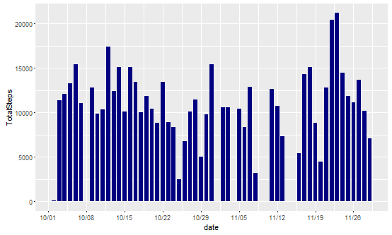
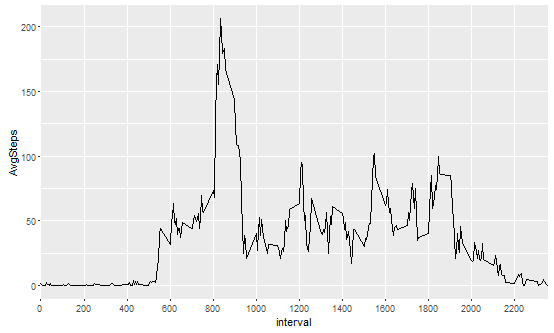
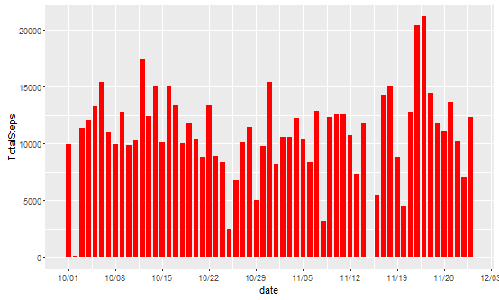

## Loading and preprocessing the data

**The code:**
```{r}
library(ggplot2)
library(dplyr)
library(scales)

read.csv("activity.csv") %>% tbl_df()->rawds
as.Date(rawds$date)->rawds$date
mutate(rawds,'Weekdays'=weekdays(date))->rawds
```
1. Library the three packages that would be used in this project: ggplot2, dplyr and scales. 
2. Read the data and save it into rawds. Transform the data class into Date class. 
3. Add a new column on the right called Weekdays of the table, indicating the weekday of eah observation. This column will become crucial later.

## What is mean total number of steps taken per day?

**Calculate the mean for each day**
```{r}
group_by(rawds,date) %>% summarise('TotalSteps'=sum(steps))->dds
```
1. Devide rawds into groups according to dates.
2. Sum up the steps for each day, and save it into a new table dds.

**The code for the plot:**
```{r,echo=True}
p<-ggplot(dds,aes(x=date,y=TotalSteps))+
        geom_bar(stat="identity",fill="navy blue",width=0.75)+
        scale_x_date(labels = date_format('%m/%d'),date_breaks = "1 week")
p
```


**Calculate the mean and median over all observations**
```{r}
mean(dds$TotalSteps,na.rm=T)
median(dds$TotalSteps,na.rm=T)
```
As calculated above, the mean is 10766.19 and the median is 10765.

## What is the average daily activity pattern?

**The code to process data:**
```{r}
group_by(rawds,interval)->ids
summarise(ids,'AvgSteps'=mean(steps,na.rm=T))->ids
```
1. Devide rawds into groups according to intervals (so there will be 60*24/5=288 groups).
2. Calculate the mean of steps and save it in ids.

**The time series plot of the five-minute intervals**
```{r,echo=T}
q<-ggplot(ids,aes(x=interval,y=AvgSteps))+
        geom_line()+
        scale_x_discrete(breaks=seq(from=0,by=200,to =2355))
q
```


**The code to find the interval with the most steps:**
```{r}
ids[which.max(ids$AvgSteps),1]
```
On average, the interval with most steps is 835, which is 8:35 a.m..


## Imputing missing values

**Code to find the number of total NAs and their distributions:**
```{r}
sum(is.na(rawds$steps))
rawds[is.na(rawds$steps),]->temp
table(temp$date)[table(temp$date)!=0]->temp
```
1. There are 2304 NAs.
2. 2012-10-01, 2012-10-08, 2012-11-01, 2012-11-04, 2012-11-09, 2012-11-10, 2012-11-14 and 2012-11-30 equally have 288 NAs respectively. This shows that if a NA appears in any interval of a day, then other intervals of that day will also be NAs.

The main idea of the strategy is to find the weakday of each day with all NAs, and then replace those NAs with the mean of each interval on that weekday. For example, 2012-10-01 is a Saturday whose steps are all NAs. Then I will replace the NAs on 2012-10-01 with the mean of steps of Monday.

```{r}
group_by(rawds,Weekdays,interval)->avg.wids
summarize(avg.wids,'AvgSteps'=mean(steps,na.rm=T))->avg.wids
rawds->rawds2
for (i in 1:nrow(rawds2)){
        if (is.na(rawds2[i,1])){
                rawds2[i,1]<-filter(avg.wids,Weekdays==rawds2$Weekdays[i] & interval==rawds2$interval[i])$AvgSteps[1]
        }
}
```
1. The avg.wids serves like a index here, recording the mean steps on every weekday
2. Copy rawds to rawds2
3. Replace all NAs in the raw data with information in avg.wids.

**Code to calculate the average after replacing all NAs and its plot:**
```{r}
group_by(rawds2,date) %>% summarise('TotalSteps'=sum(steps))->dds2
r<-ggplot(dds2,aes(x=date,y=TotalSteps))+
        geom_bar(stat="identity",fill="red",width=0.75)+
        scale_x_date(labels = date_format('%m/%d'),date_breaks = "1 week")
r
```


**Code to calculate the mean and median:**
```{r}
mean(dds2$TotalSteps,na.rm=T)
median(dds2$TotalSteps,na.rm=T)
```

As calculated above, the mean is 10821.21 and the median is 11015. The mean and median after filling the NAs grow higher than before.

## Are there differences in activity patterns between weekdays and weekends?

****
```{r}
mutate(rawds2,'WeekdaysOrWeekends'=ifelse(Weekdays %in% c('Sunday', 'Saturday'),'Weekend','Weekday'))->rawds2
as.factor(rawds2$WeekdaysOrWeekends)->rawds2$WeekdaysOrWeekends
group_by(rawds2,WeekdaysOrWeekends,interval)->wwids
summarize(wwids,'AvgSteps'=mean(steps))->wwids
```
1. Create a new factor variable to distinguish weekday and weekend day and save it in rawds2.
2. Devide rawds2 into groups according to the factors just created and interval.
3. Calculate the mean for each group.

**Code for the plot:**
```{r}
s<-ggplot(wwids,aes(interval,AvgSteps))+
        geom_line()+
        scale_x_discrete(breaks=seq(from=0,by=200,to =2355))+
        facet_grid(WeekdaysOrWeekends~.)
s
```


There are some difference between the two patters. For example, on weekdays, activity starts before 6 a.m.. On weekends, however, it starts around 8 a.m.. This might shows this guy has to work on weekdays, so he gets up early for work. Naturally, he can stay on his bed late on weekends, which he does.