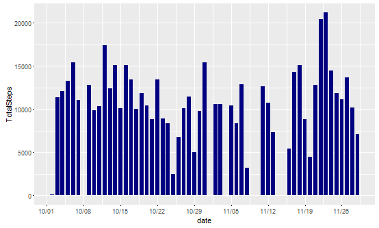
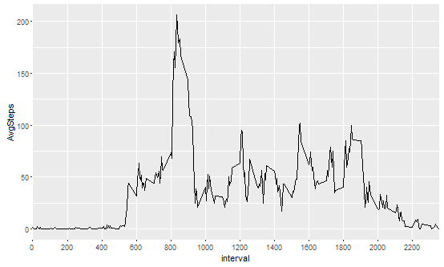

## Loading and preprocessing the data

**The code:**
```{r}
library(ggplot2)
library(dplyr)
library(scales)

read.csv("activity.csv") %>% tbl_df()->rawds
as.Date(rawds$date)->rawds$date
mutate(rawds,'Weekdays'=weekdays(date))->rawds
```
1. First, library the three packages that would be used in this project: ggplot2, dplyr and scales. 
2. Read the data and save it into rawds. Transform the data type of column date into Date class. 
3. Finally add a new column on the right-most of the table called Weekdays, indicating the weekday of the date. This column will become crucial later.

## What is mean total number of steps taken per day?

**Calculate the mean for each day**
```{r}
group_by(rawds,date) %>% summarise('TotalSteps'=sum(steps))->dds
```
1. Devide rawds into groups according to dates.
2. Sum up the steps for each day, and save it into a new table dds.

**The code for the plot:**
```{r,echo=F}
p<-ggplot(dds,aes(x=date,y=TotalSteps))+
        geom_bar(stat="identity",fill="navy blue",width=0.75)+
        scale_x_date(labels = date_format('%m/%d'),date_breaks = "1 week")
p
```


**Calculate the mean and median over all observations**
```{r}
mean(dds$TotalSteps,na.rm=T)
median(dds$TotalSteps,na.rm=T)
```
As calculated above, the mean is 10766.19 and the median is 10765.

## What is the average daily activity pattern?

**The code to process data:**
```{r}
group_by(rawds,interval)->ids
summarise(ids,'AvgSteps'=mean(steps,na.rm=T))->ids
```
1. First, devide rawds into groups according to intervals (so there will be 60*24/5=288 groups).
2. Then calculate the average steps and save it in ids.

**The time series plot of the five-minute intervals**
```{r,echo=T}
q<-ggplot(ids,aes(x=interval,y=AvgSteps))+
        geom_line()+
        scale_x_discrete(breaks=seq(from=0,by=200,to =2355))
q
```


**The code to find the interval with the most steps:**
```{r}
ids[which.max(ids$AvgSteps),1]
```
On average, the interval with most steps is 835, which is 8:35 a.m..


## Imputing missing values


## Are there differences in activity patterns between weekdays and weekends?
